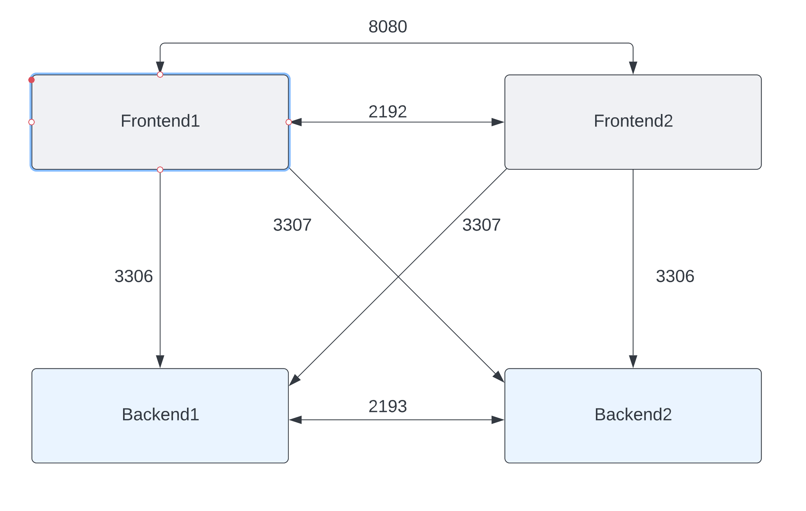

# tf-azure
 4-Node terraform deployment for CSW/Azure demo

This sets up a quick, easily demo'able environment within Azure. It simply deploys 4 nodes, where an iperf service is setup for each provided port(s). The consumer nodes have cron jobs that run randomly to generate the traffic. This provides great application dependency mapping results, and is easily used for enforcement demos.

* Install the Azure CLI on your machine and login (see https://learn.microsoft.com/en-us/cli/azure/)
* Generate an SSH key within Azure. Save the public and private keys somewhere safe! 
* Download/clone repo to a local directory
* Create a file named 'id_rsa.pub' (if not already there), and place your public key string in there (this will be used when provisioning azure vm's)
* Put a copy of the private key within the 'ansible' directory (this will be used to login to the azure vm's to configure)
* I had an existing network watcher within azure that I wished to use. So I simply referenced this as a 'data' object within my variables.tf file. You may want to update this with your network watcher, or create a new one. This is also referened within my flow_logs.tf file.

To provision drop into the cloned directory and:
1) terraform init
2) terraform apply
3) Update ansible/inventory with the public and private IP addresses from the terraform job output
4) ansible-playbook site.yml -i inventory --private-key [your private key file]

To-Do:
--------------------
* Get familiar with the azure_rm dynamic ansible inventory, and automatically retrieve the private/public IPs and dynamically create inventory file
